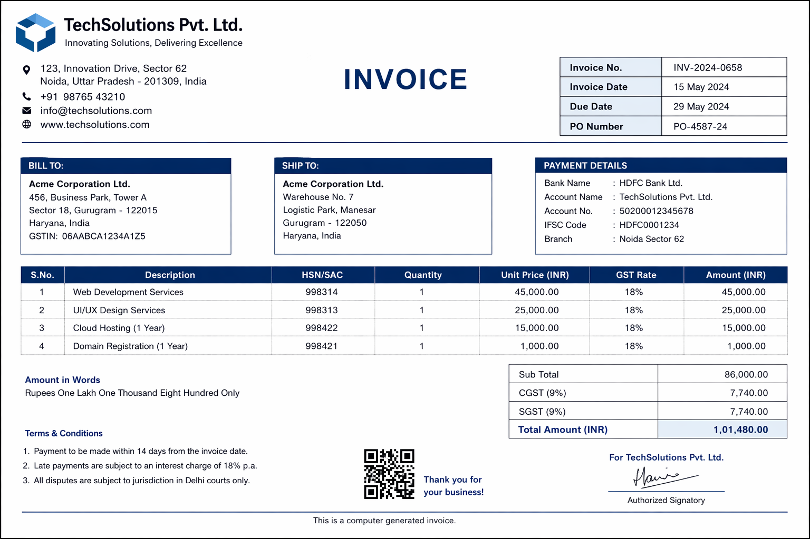
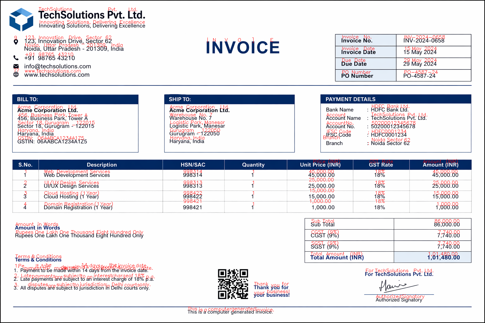
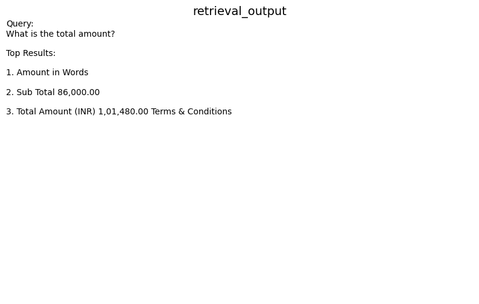
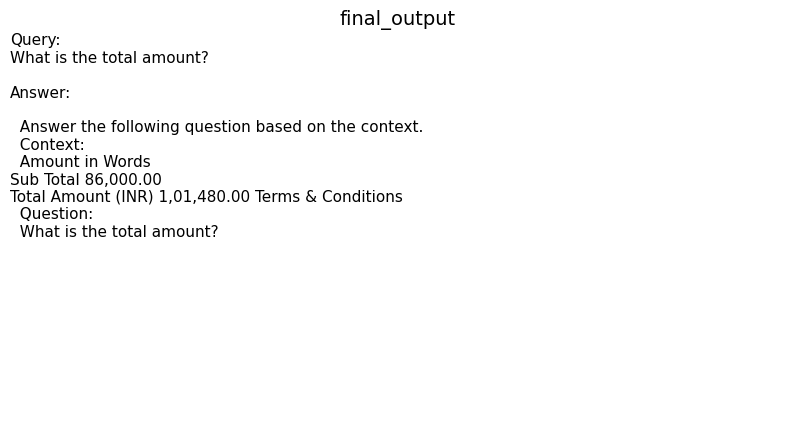

<h1 align="center">🚀 DocuMind AI</h1>
<p align="center"><b>Multi-Modal Document Intelligence System</b></p>

<p align="center">
  
  
  
  
</p>

<p align="center">
  <i>Transforming raw documents into intelligent, queryable knowledge</i>
</p>

---

## 🌟 What is DocuMind AI?

**DocuMind AI** is an end-to-end AI system that can read, understand, and answer questions from documents such as PDFs and scanned images.

It combines:

* 📄 OCR (Optical Character Recognition)
* 🧠 Semantic Understanding (Embeddings)
* 🔍 Intelligent Search (FAISS)
* 🤖 AI Reasoning (LLM)

👉 In simple words:

> You give a document → It understands → You ask questions → It answers intelligently.

---

## 🧠 Why This Project Matters

Most document systems:

* ❌ Just extract text
* ❌ Cannot understand context

DocuMind AI:

* ✅ Understands meaning
* ✅ Finds relevant information
* ✅ Answers like an intelligent assistant

This is the same principle behind modern AI systems like:

* ChatGPT for documents
* Enterprise document AI tools

---

## 🏗️ System Architecture

```
Document → OCR → Structured Text → Embeddings → FAISS → LLM → Answer
```

### 🔍 Step-by-Step Flow

1. **Document Input**

   * PDF / Image

2. **OCR Processing**

   * Extracts raw text from images

3. **Layout Structuring**

   * Groups text into meaningful lines & fields

4. **Embeddings Generation**

   * Converts text into numerical meaning vectors

5. **Semantic Retrieval (FAISS)**

   * Finds most relevant content for a query

6. **LLM Reasoning**

   * Generates final human-like answer

---

## 📊 Demo (System in Action)

### 📄 Input Document



### 🔎 OCR + Layout Understanding



### 🔍 Semantic Retrieval



### 🤖 Final AI Answer



---

## ⚙️ Tech Stack

### Core

* Python

### Document Processing

* Tesseract OCR
* pdfplumber

### AI / ML

* Sentence Transformers
* HuggingFace Transformers

### Retrieval

* FAISS (Vector Database)

### Image Processing

* OpenCV
* Pillow

---

## 📂 Project Structure

```
documind-ai/
│
├── data/              # Input documents
├── outputs/           # Generated results
├── assets/            # README visuals
├── notebooks/         # Development notebook
├── src/               # Core modules
├── main.py            # Pipeline entry point
├── requirements.txt
└── README.md
```

---

## 🚀 Getting Started

### 1. Clone Repository

```bash
git clone https://github.com/your-username/documind-ai.git
cd documind-ai
```

### 2. Install Dependencies

```bash
pip install -r requirements.txt
```

### 3. Run the System

```bash
python main.py
```

---

## 🧪 Example Queries

Try asking:

* What is the total amount?
* Who is the client?
* What is the invoice number?

---

## 📦 Outputs Generated

| File                  | Description              |
| --------------------- | ------------------------ |
| ocr_text.txt          | Raw extracted text       |
| structured_data.json  | Structured document      |
| retrieval_results.txt | Top relevant chunks      |
| final_answer.txt      | AI-generated answer      |
| full_pipeline.json    | Complete pipeline output |

---

## 🔥 Key Highlights

* Built complete **RAG pipeline from scratch**
* Fully **offline AI system (no API dependency)**
* Handles **real-world noisy documents**
* Implements **semantic search using FAISS**
* Clean modular **production-style architecture**

---

## ⚠️ Challenges & Learnings

* Faced dependency issues with Detectron2
* Switched to OCR-based layout (more stable & practical)
* Learned importance of:

  * Data preprocessing
  * Retrieval quality
  * System design over tools

---

## 📈 Future Improvements

* Advanced layout detection (LayoutLM / Detectron2)
* Table extraction system
* Streamlit-based UI
* Multi-document querying

---

## 💼 Resume Highlight

> Built an end-to-end Multi-Modal Document Intelligence System using OCR, FAISS, and open-source LLMs to enable semantic document search and automated question answering.

---

## ⭐ Support

If you found this project useful, consider giving it a ⭐

---

## 👨‍💻 Author

**Vinit Singh Pathir**

---

<p align="center"><b>🚀 Built with real-world engineering mindset</b></p>
